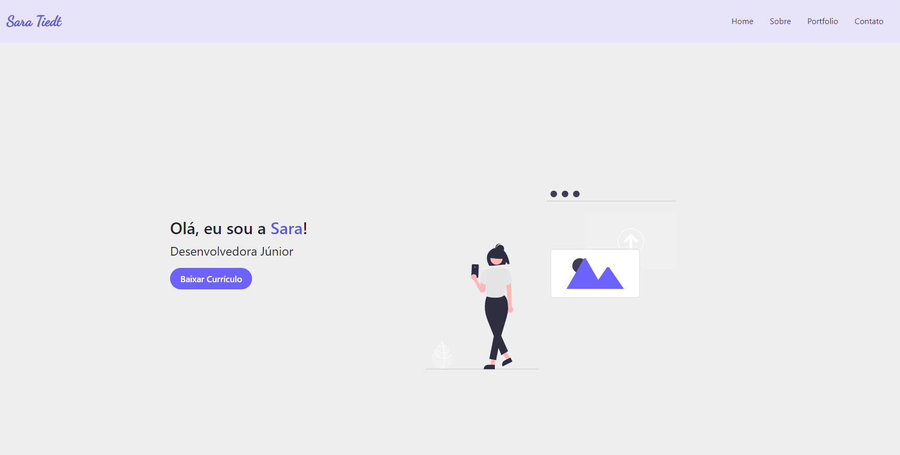

# Oficina de Frontend - Desenvolvendo um Portfólio Pessoal 👩‍💻

## 📄  Sobre o Projeto

Queremos te mostrar o que é possível fazer com HTML e CSS e te dar um rumo para que você adquira a base de conhecimento necessária para continuar com o aprendizado!

Nesta oficina você construirá um website de Portfólio Pessoal para disponibilizar seu currículo, com um espaço dedicado para contar um pouco sobre você, uma sessão exclusiva para apresentar os projetos que você já tem em seu portfólio e as principais formas de entrar em contato com você!

## 📋 Quer saber mais sobre a oficina?

Assista o vídeo de introdução e confira  o resultado final:
[Introdução - Oficina de Frontend](https://www.loom.com/share/797d52c891c448fdb7b2eb3cb2e11a4b)

### Ao longo de sete aulas vamos te ensinar a construir este [Portfólio Pessoal](https://portfoliopessoal.rayanaprata.repl.co/). 
Você poderá customizá-lo e deixar do seu jeito! 💜

## 👉🏻 Desenvolva o projeto com a gente:

- [ ] [Aula 01 - Iniciando o Projeto](https://www.loom.com/share/b7dd10ecaa754cd588516409bbc1455a)

- [ ] [Aula 02 - HTML do Menu de Navegação](https://www.loom.com/share/051cdfe24d9a41909c0097ecb020a86b)

- [ ] [Aula 03 - Estilizando o Menu de Navegação](https://www.loom.com/share/0a39ab45594848c789dd48d0472a5f8c)

- [ ] [Aula 04 - Home](https://www.loom.com/share/6d7b8d55f6a1420ba2ee6e289e174674)

- [ ] [Aula 05 - Sobre](https://www.loom.com/share/0ed33b2ed9eb46c1be07c2835099189d)

- [ ] [Aula 06 - Portfólio](https://www.loom.com/share/70ec323a92824cc1931dedfced2343f1)

- [ ] [Aula 07 - Footer](https://www.loom.com/share/516462d624e14caea5ad205abcdce951)

## 💡 Conceitos apresentados na Oficina:

 - **HTML** - define a estrutura de elementos.
 - **CSS** - define a aparência, o estilo dos elementos.

## 🌈 Material Complementar:

→  Nós vamos utilizar o [Replit](https://replit.com) para construir nosso projeto

→  Para criar o ícone que fica ao lado do título da nossa janela no navegador vamos utilizar o site [favicon.io](https://favicon.io/)

→  A ilustração da sessão de Home vamos pegar alguma de nossa preferência no site [undraw.co](https://undraw.co/)

→  Acesse esta documentação do [HTML](https://developer.mozilla.org/pt-BR/docs/Web/HTML) e esta do [CSS](https://developer.mozilla.org/pt-BR/docs/Web/CSS) quando tiver dúvidas ou quiser saber mais

## 🚀 Continue sua jornada

#### Sugerimos que você continue seu aprendizado realizando o [curso gratuito de Desenvolvimento de Frontend](http://mooc.ifsertao-pe.edu.br/course/desenvolvimento-de-front-end/intro/) oferecido pelo [IF Sertão](http://mooc.ifsertao-pe.edu.br/).

---

Projeto de Portfólio Pessoal desenvolvido durante a Oficina Frontend ministrada por [Rayana Prata](https://github.com/rayanaprata) e [Sara Tiedt](https://github.com/saratiedt) para o Extenda-se realizado pelo Instituto Federal de Santa Catarina Câmpus Gaspar. ✨
